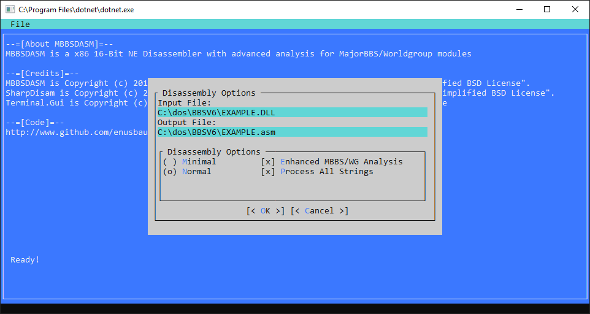

# MBBSDASM




**MBBSDASM** is a Disassembler for 16-bit Segmented Executable File Format ("New Executable", or just NE) files. The Disassembler itself is written in C# using .Net Core.

It was created to assist in my own personal education of The MajorBBS (MBBS) Bulletin Board System by GALACTICOMM, which was one of the first multi-line, multi-user commercial BBS systems available at the time of its hayday. MBBS loaded modules that were an early version of DLL's files built with Borland Turbo C++.

For more information on The Major BBS and Worldgroup by GALACTICOMM, check out the Wikipedia article [[here](https://en.wikipedia.org/wiki/The_Major_BBS)].

While **MBBSDASM** targets Major BBS/Worldgroup files for analysis, any 16-bit NE EXE/DLL file is supported and should disassemble without issue. I've tested this with both Solitaire and Calculator from Windows 3.1 to verify.

# Text UI

**MBBSDASM** provides support for a cross-platform Text-Based UI (TUI) thanks to the fantastic Terminal.Gui library! To access the TUI, simply run MBBSDASM with no command line arguments.

# Example Command Line

**MBBSDASM** supports disassembly of MajorBBS/Worldgroup modules via command line as well.

An example command line to disassemble a DLL and perform enhanced MajorBBS/Worldgroup Analysis:
```
-i c:\bbsv6\example.dll -o c:\bbsv6\output.txt -strings -analysis
```

# Current Features
**MBBSDASM** offers several disassembly/code analysis options that are configurable through the command line.

#### Minimal Disassembly (-minimal)
Minimal will output the disassembled x86 code segments labeled with SEGMENT:OFFSET with no additional analysis.

```asm
00000C68h:0002.0068h 83C408          add sp, 0x8
00000C6Bh:0002.006Bh 68FF7F          push 0x7fff
00000C6Eh:0002.006Eh 680180          push 0x8001
00000C71h:0002.0071h 6A07            push 0x7
00000C73h:0002.0073h 9AFFFF0000      call word 0x0:0xffff
00000C78h:0002.0078h 83C406          add sp, 0x6
00000C7Bh:0002.007Bh A3EC02          mov [0x2ec], ax
00000C7Eh:0002.007Eh 6A08            push 0x8
00000C80h:0002.0080h 9AFFFF0000      call word 0x0:0xffff
00000C85h:0002.0085h 59              pop cx
00000C86h:0002.0086h 89160403        mov [0x304], dx
00000C8Ah:0002.008Ah A30203          mov [0x302], ax
```
#### Normal Disassembly (default)
Normal will output the disassembled x86 code segments labeled with SEGMENT:OFFSET as well as processing:
* Processing Segment Relocation Table Entries
* Resolve External References
* String Reference Resolution (best guess)
* Identify and Label Conditional/Unconditional Jumps as well as Function Calls
```asm
00000C68h:0002.0068h 83C408          add sp, 0x8
00000C6Bh:0002.006Bh 68FF7F          push 0x7fff
00000C6Eh:0002.006Eh 680180          push 0x8001
00000C71h:0002.0071h 6A07            push 0x7
00000C73h:0002.0073h 9AFFFF0000      call word 0x0:0xffff          ; call MAJORBBS.Ord(01B9h)
00000C78h:0002.0078h 83C406          add sp, 0x6
00000C7Bh:0002.007Bh A3EC02          mov [0x2ec], ax
00000C7Eh:0002.007Eh 6A08            push 0x8
00000C80h:0002.0080h 9AFFFF0000      call word 0x0:0xffff          ; call MAJORBBS.Ord(0236h)
00000C85h:0002.0085h 59              pop cx
00000C86h:0002.0086h 89160403        mov [0x304], dx
00000C8Ah:0002.008Ah A30203          mov [0x302], ax
```

#### Enhanced Analysis Mode (-analysis)
Enhanced Analysis mode enables **MBBSDASM** to provide additional detailed analysis of Major BBS & Worldgroup Modules/DLL's with information provided from the Major BBS 6.25 Software Development Kit as well as GALACTICOMM's Developer's Guide for The Major BBS 6.2 [[link](http://software.bbsdocumentary.com/IBM/WINDOWS/MAJORBBS/devguide.pdf)]

Additional disassembly analysis includes:
* Automatic Documentation on a large portion of the most MAJORBBS & GALGSBL functions
* Provide Method Signatures in place of the external module calls
* Reverse Engineer and rebuild method signatures with the actual input values built from the x86 Assembly
* Identify FOR loops generated by the Borland Turbo C++ compiler and label them
* Basic variable tracking and labeling

The Enhanced Analysis mode can be extended through pull requests by adding Module Definition JSON files for known libraries.
```asm
00000C68h:0002.0068h 83C408          add sp, 0x8
00000C6Bh:0002.006Bh 68FF7F          push 0x7fff
00000C6Eh:0002.006Eh 680180          push 0x8001
00000C71h:0002.0071h 6A07            push 0x7
00000C73h:0002.0073h 9AFFFF0000      call word 0x0:0xffff          ; int numopt(int msgnum,int floor,int ceiling);
                                                                   ; Resolved Signature: numopt(7, 32769, 32767)
                                                                   ; Retrieves a numeric option from MCV file
00000C78h:0002.0078h 83C406          add sp, 0x6
00000C7Bh:0002.007Bh A3EC02          mov [0x2ec], ax               ; Return value saved to 0x2ECh
00000C7Eh:0002.007Eh 6A08            push 0x8
00000C80h:0002.0080h 9AFFFF0000      call word 0x0:0xffff          ; char *string=stgopt(int msgnum);
                                                                   ; Resolved Signature: char *string=stgopt(8);
                                                                   ; Gets a string from an MCV file
00000C85h:0002.0085h 59              pop cx
00000C86h:0002.0086h 89160403        mov [0x304], dx
00000C8Ah:0002.008Ah A30203          mov [0x302], ax               ; Return value saved to 0x302h
                                                                   ; AX holds pointer, DX holds size in return from function
```
# What's Next
* Enhance MBBS Analysis
    * Enhanced Variable Labeling and Tracking
    * Enhanced Auto-Documentation of GALGSBL and MAJORBBS imported function
* Add support for DOS MZ EXE files
	* This would allow disassembly of the MajorBBS/WG EXE files
* Add support for Worldgroup 3.0+
    * Requires additional support for disassembly of 32-bit PE format EXE/DLL files
	* The best tool for this is probably IDA Freeware, which disassembles PE files with ease

# Contribute
I'm always looking for updated/new information on several related topics. If you have any first hand knowledge, documentation or files you can send me related to:

* The MajorBBS/Worldgroup Development Documentation (beyond already available SDK docs)
* Unreleased/publically unavailable source code for commercial modules

Any information sent my way will be kept **strictly confidential** and will only be used as a point of reference for enhancing this research project. My goal here is to not let the past just rot away in ZIP files but give people a chance to learn how systems like The MajorBBS and Worldgroup worked.

Additionally, please feel free to submit pull requests with enhancements and bug reports with any issues you might be experiencing!

# Thanks

The project makes use of [SharpDiasm](https://github.com/spazzarama/SharpDisasm) to do the actual Disassmebly of the Code Segments into 16-bit x86 Assembly Language.

A big shoutout to the grey beards keeping this archaic software alive and still available 25+ years later, folks I've interacted with related to MBBS/WG over the years (you know who you are), and the people involved with The BBS Documentary [[link](http://www.bbsdocumentary.com/)]

# License / Copyright

MBBSDASM is Copyright (c) 2017 Eric Nusbaum and is distributed under the 2-clause "Simplified BSD License". 
SharpDisam is Copyright (c) 2015 Justin Stenning and is distributed under the 2-clause "Simplified BSD License". 
Terminal.Gui is Copyright (c) 2017 Microsoft Corp and is distributed under the MIT License

Portions of the project are ported from Udis86 Copyright (c) 2002-2012, Vivek Thampi <vivek.mt@gmail.com> https://github.com/vmt/udis86 distributed under the 2-clause "Simplified BSD License".
